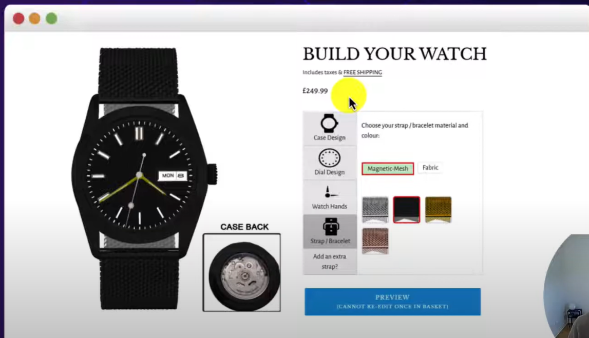
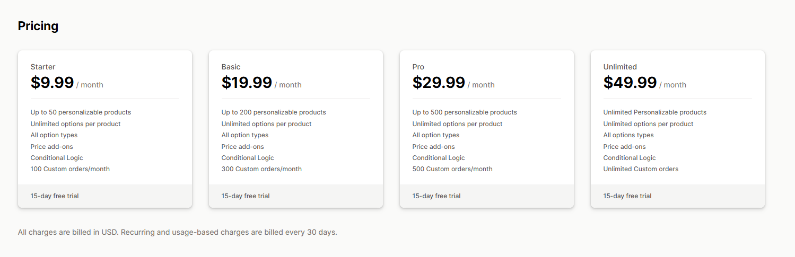
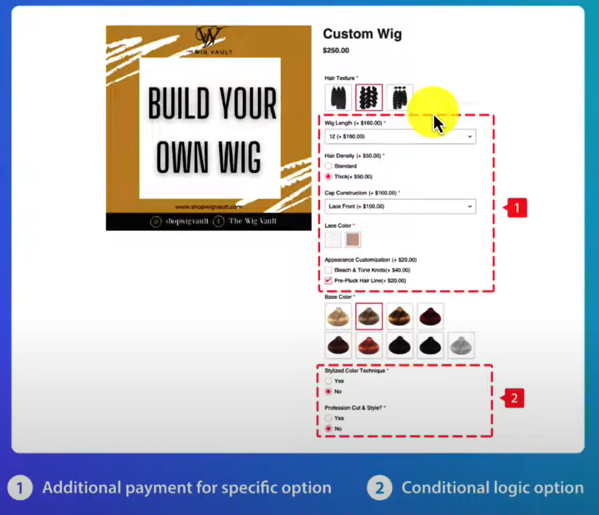
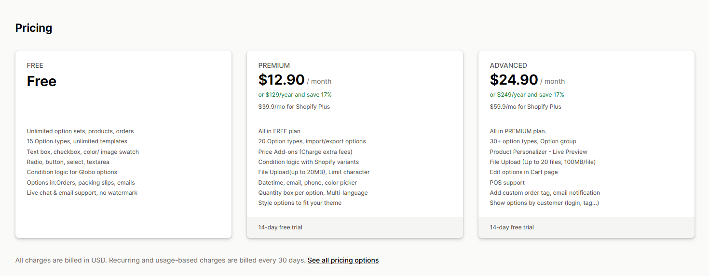
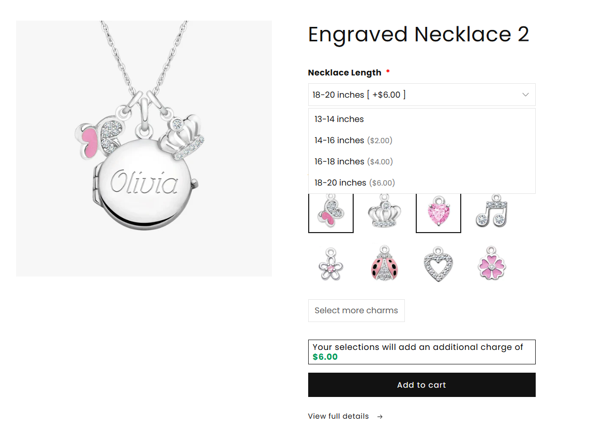
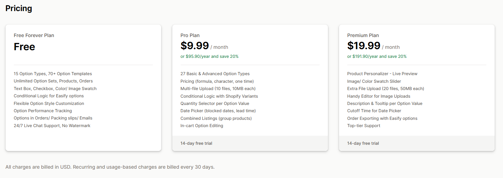
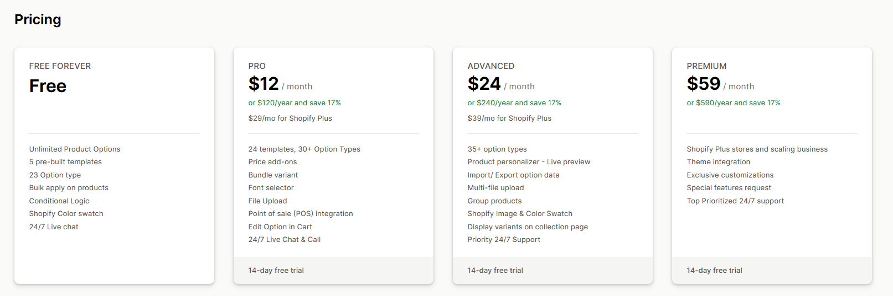

# Product Options for Toppers, Etc

## List of Potential Applications to serve acceptance criteria
- Zepto Product Personalizer
- Global Product Options
- Easify Product Options

## Zepto Product Personalizer
Unlimited Product Options with Live preview (4.8 Star rating)

### Features 
There is an option to upcharge for custom options which will end up costing $19.99/month for 299 products or $29.99 per month for 500 products or 49.99 for unlimited products.

#### Strengths 
- Seamless embed via theme customizer for any theme (2.0 preferred).
- Responsive design works across devices; live previews adapt to your styling.
- Custom fonts/colors easily match your theme.

#### Drawbacks
- Occasional manual positioning tweaks for non-2.0 themes.
- Some users note initial setup time for complex previews.

## Globo Product Options
Product Personalization, Customize Product, Product Variants 
    - Build different Option sets for different products with custom style, color, and font
    - There is an option to upcharge for custom options 

### Features
Pricing appears to meet criteria for use case at $12.90 Monthly or $129 Annual

#### Strengths 
- Smooth, user-friendly embed with conditional logic that fits most themes.
- Supports custom styles (e.g., colors, fonts) to blend seamlessly.
- Quick fixes for theme conflicts via support.

#### Drawbacks
- Rare off-hours support delays for urgent theme tweaks.
- Minor integration needed for trial-mode themes.

## Easify Custom Product Options
Pricing of $9.99 allows you to customize pricing for each product option
<a href="https://apps.shopify.com/easify-product-options?surface_detail=product-options-pro&surface_inter_position=1&surface_intra_position=1&surface_type=app_details"> View in App Store </a> 

#### Strengths 
- Fully compatible with 2.0 themes; easy activation in theme customizer.
- Live previews and option fields auto-adapt to your layout.
- Proactively handles theme drafts for safe testing.

#### Drawbacks
- Potential conflicts with heavily customized themes (rare, support resolves fast).
- Limited to 2.0 for optimal no-code setup.

## Avis Product Options, Variants
Seems legit 
<a href="https://apps.shopify.com/avisplus-product-options?surface_detail=easify-product-options&surface_inter_position=1&surface_intra_position=3&surface_type=app_details"> View in App Store </a> 

#### Strengths 
- Excellent no-code embed; auto-matches your theme's styling and layout.
- Strong conditional logic integrates with native Shopify variants.
- Mobile-friendly across all devices with minimal tweaks.

#### Drawbacks
- Initial import from other apps can be fiddly (not theme-specific).
- Best for 2.0; older themes may need light support.
